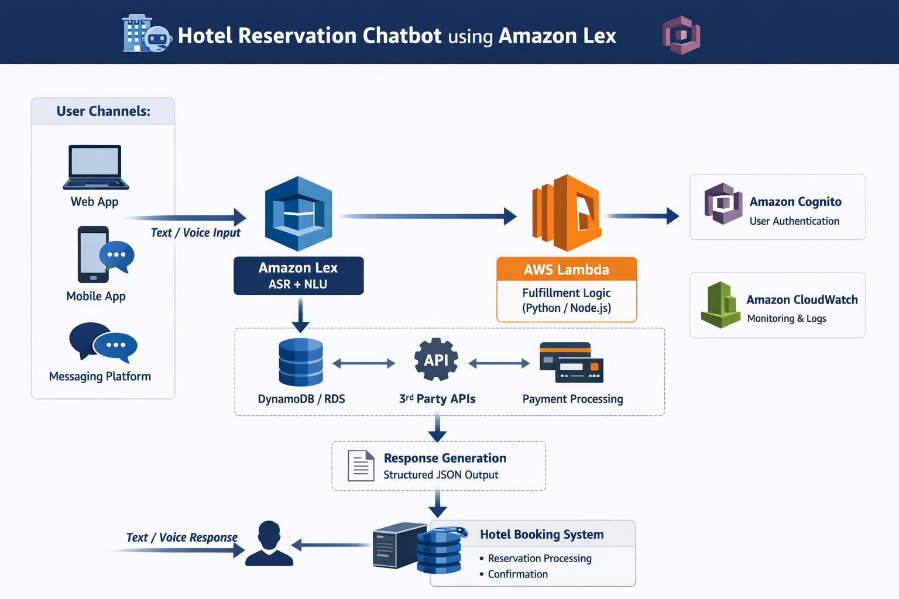

# 🏨 Hotel Reservation Chatbot – AWS Solution Architecture

This repository contains the **Solution Architecture for a Serverless Hotel Reservation Chatbot built using AWS Services**.  
The system enables users to search hotels, check availability, and make reservations through **Text Interactions**.

---

## 📊 Architecture Diagram

---

## 🚀 Overview

The chatbot uses **Amazon Lex** for conversational AI and **AWS Lambda** for backend fulfillment logic.  
It integrates with databases, third-party APIs, and payment systems to process hotel reservations in real time.

---

## 🧰 AWS Services Used

- **Amazon Lex** – Conversational AI (ASR + NLU)
- **AWS Lambda** – Serverless backend logic
- **Amazon DynamoDB / RDS** – Reservation data storage
- **Amazon Cognito** – User authentication
- **Amazon CloudWatch** – Monitoring and logging

---

## 🔄 Workflow

1. User sends a **text request** via web or mobile.
2. **Amazon Lex** detects the intent.
3. Lex triggers **AWS Lambda** for fulfillment.
4. Lambda interacts with **databases, APIs, and payment services**.
5. The system processes the reservation and returns a **booking confirmation**.

---

## 🎯 Key Concepts Demonstrated

- Serverless Architecture  
- Event-Driven Design  
- Conversational AI  
- Scalable Cloud Applications  

---

👨‍💻 **Author:** Anirudh Srinivasan
